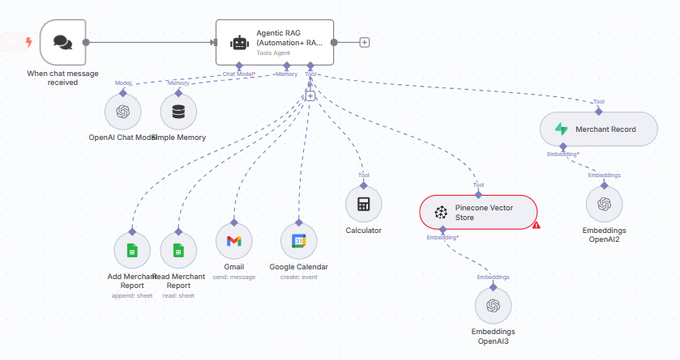
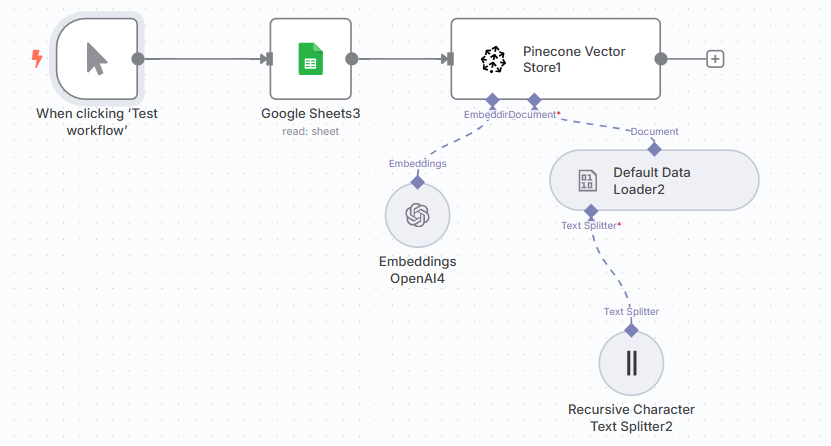

# 🤖 G-Bot: Grab’s AI-Powered Merchant Assistant

## 🧠 Introduction

G-Bot is a powerful AI chatbot designed to assist Grab’s merchant-partners (MEX) with intelligent, real-time business insights, personalized guidance, automation, and technical analysis. With an intuitive chat-based interface, G-Bot empowers merchants to streamline operations, track performance, and make smarter business decisions—hands-free.

Whether it's generating reports, visualizing trends, scheduling tasks, or answering deep analytical queries, G-bot is your all-in-one business co-pilot.

---

## 🔗 Links

- 📹 [Prototype Link](https://foxly.app.n8n.cloud/webhook/c633c33b-7c1e-4a08-823b-3a4d7ba5ac52/chat)  
- 🎨 [Figma Prototype](https://www.figma.com/proto/IXbbgljL8RpOS9F4v6xR4u/UMhackathon2025?node-id=20-62&p=f&t=iqqkOraA7oTrnSAu-1&scaling=scale-down&content-scaling=fixed&page-id=0%3A1&starting-point-node-id=20%3A62)
- 📹 [Canva Slides](https://www.canva.com/design/DAGkVeCCS20/Xi5GGKky30RXcP7qXvTHnQ/edit)
  
---

## 📍 Problem Statement

Grab's mission is to economically empower Southeast Asians through innovative technologies. Merchant-partners play a crucial role in Southeast Asia’s digital economy, but many struggle with:

Understanding their sales trends and inventory performance
Making data-driven decisions with limited technical know-how
Performing repetitive and time-consuming tasks
Gaining personalized insights tailored to their unique business

With the rise of Generative AI, G-Bot was built to address these challenges by delivering:

⚡ Real-time business insights
🔍 Personalized recommendations
📊 Automated visual analytics
🤖 Workflow automation
🧾 Detailed reports and financial summaries

---

## 🧩 Components & Technology Stack

Architecture Workflow

  

#@ 🧠 AI Assistant Workflow (LangChain-Based)

This document outlines the workflow of an AI assistant system built using LangChain, designed to handle chat-based queries and execute tasks like data entry, report reading, scheduling, and smart retrieval using RAG (Retrieval-Augmented Generation).

---

## 📌 Workflow Steps

1. **User Message Trigger**
   - A user sends a message through a chatbot (e.g., web app, Telegram, WhatsApp).
   - The message is received by a backend service (e.g., FastAPI or Flask).

2. **Message Passed to LangChain Agent**
   - The message is routed to a LangChain agent.
   - The agent uses OpenAI's GPT-4 as the language model and `ConversationBufferMemory` to keep context across interactions.

3. **Agent Interprets User Intent**
   - LangChain parses the message using the LLM and decides which tool or action to invoke.

4. **Executing Task Based on Intent**
   - Based on the user’s request, the agent activates the appropriate tool:
     - ✅ **Add data to datasheet** → `GoogleSheetsAppendTool`
     - ✅ **Read data from datasheet** → `GoogleSheetsReadTool`
     - ✅ **Send email** → Gmail API
     - ✅ **Create calendar event** → Google Calendar API
     - ✅ **Perform calculations** → Built-in calculator tool

5. **Handling Knowledge-Based Queries (RAG)**
   - For document-related or context-heavy questions:
     - Embeddings are generated using `OpenAIEmbeddings`
     - Stored and searched in **Pinecone Vector Store**

6. **Retrieving Relevant Context**
   - The agent queries Pinecone for the most relevant information.
   - Retrieved data is used to generate a high-quality, accurate answer via the LLM.

7. **Responding to User**
   - The AI sends a natural language response containing the results or actions taken.

8. **Maintaining Conversation Flow**
   - Using `ConversationBufferMemory`, the agent maintains memory of the current session, enabling follow-up questions like:
     - “What about yesterday?”
     - “Send that to my email.”

---

## 🔧 Example Scenarios

- **"Add today’s sales to the merchant report"**  
  → AI appends the data to Google Sheets.

- **"Read last week’s report"**  
  → AI reads the data from the sheet and summarizes it.

- **"Send me a summary of top merchants"**  
  → AI retrieves and analyzes vector data from Pinecone, then sends a summary.

- **"Schedule a meeting tomorrow at 3 PM"**  
  → AI creates an event in Google Calendar

---
Vector Database

  

## 🧠 Vector Database Workflow (Supabase + OpenAI Embeddings)

This flow shows how structured data (e.g., business reports, merchant data) is ingested into a vector store using embeddings for semantic retrieval in AI tasks.

---

## 📌 Workflow Steps

1. **Read Google Sheets Data**
   - The system pulls data from a Google Sheet using a `read.sheet` operation.
   - Example: Sales records, merchant performance, or feedback logs.

2. **Convert to CSV File**
   - The sheet data is converted into a `.csv` format using the **Convert to File** node.
   - This makes the data suitable for loading and preprocessing.

3. **Load Data to Supabase Vector Store**
   - The converted file is passed to **Supabase Vector Store**, which serves as the vector database.
   - The database will store the embedded version of the content for future semantic search.

4. **Document Loading and Chunking**
   - A **Default Data Loader** reads and loads the document.
   - A **Recursive Character Text Splitter** is used to break large text into smaller, manageable chunks for better embedding accuracy.

5. **Generate Embeddings**
   - The processed text chunks are sent to **OpenAI Embeddings (text-embedding-ada-002 or similar)** to convert them into vector representations.

6. **Store Vectors in Supabase**
   - The resulting embeddings are saved into Supabase Vector Store.
   - These vectors can now be queried using similarity search based on user input.

---

## 🔍 Example Use Case

- A user asks: **"Show me merchants who had a performance drop last week."**
  - The AI queries the Supabase vector store with the semantic meaning of the request.
  - Relevant data from the embedded spreadsheet is retrieved and summarized intelligently.

---

## 🛠️ Technologies Used Overview

- **LangChain** – Agent framework & tool orchestration
- **OpenAI GPT-4** – Language model
- **Google APIs** – Sheets, Gmail, Calendar
- **Pinecone** – Vector database for RAG
- **OpenAI Embeddings** – Text-to-vector conversion
- **FastAPI / Flask** – Webhook handler and backend

---

## ✨ Key Features & Capabilities

🧾 Real-Time Business Reports  
 Automatically generate reports on sales, inventory, and revenue breakdown.

📊 Dynamic Visual Insights  
 Instantly create bar, pie, and line charts for key metrics.

📬 Task Automation  
 Add events to Google Calendar, email partners, or sync updates through integrations.

❓ Natural Language Querying  
 Ask questions like:  
 “What’s my best-selling product this month?” and get accurate responses.

📈 Technical Analysis Assistant  
 Run margin calculations, generate forecasts, and more using structured data.

📦 Product-Level Deep Dives  
 Request specific product summaries including stock levels, demand, revenue, and growth.

🤖 RAG-Powered Memory  
 Smart memory for remembering user context and past requests.

 ## 📝 Nature of this Project

**Project Title:** G-Bot  
**Team Name:** iBUZZ

**Hackathon:** UMHACKATHON 2025

**Team Members:** Mohd Adli Syukri bin Noraman, Muhammad Irfan Azraei bin Izhar Kamil, Muhammad Adli bin Rosdan, Muhammad Haziq bin Abdullah, Adham Muqriz bin Jazlan 

**Institution:** Universiti Tenaga Nasional (UNITEN) & Asian Pacific University (APU)

### 📚 Nature of Use  
This project is a submission for the **UM Hackathon 2025**, intended exclusively for educational and competition purposes. The listed team members are students from **UNITEN** and **APU**, and the project reflects the academic and innovative effort made during the hackathon.

---

